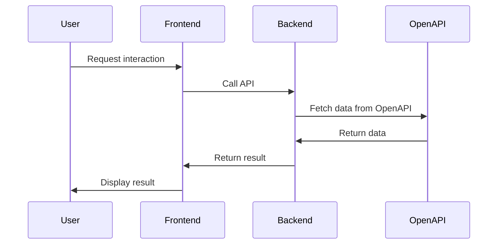

# nodejs-openai-chatgpt
This project connect to openai for tutorial

## Diagram

```mermaid
sequenceDiagram
    participant User
    participant Frontend
    participant Backend
    participant OpenAPI

    User->>Frontend: Request interaction
    Frontend->>Backend: Call API
    Backend->>OpenAPI: Fetch data from OpenAPI
    OpenAPI->>Backend: Return data
    Backend->>Frontend: Return result
    Frontend->>User: Display result
```
