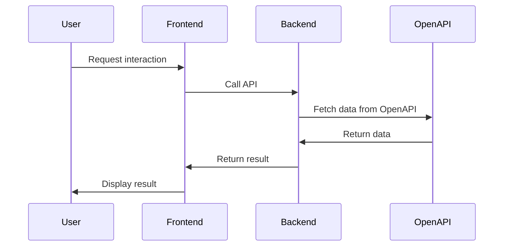

# nodejs-openai-chatgpt
This project connect to openai for tutorial

## Diagram

## Back-end

Access to folder: `back-end/back-end-openai-api`

Change `env_example` to `.env`, update OpenAI API Key

Run `npm run start`

## Front-end

Access to folder: `front-end/chat-app`

Change `env_example` to `.env`, update back-end URL: http://localhost:3001

Run `npm run dev`